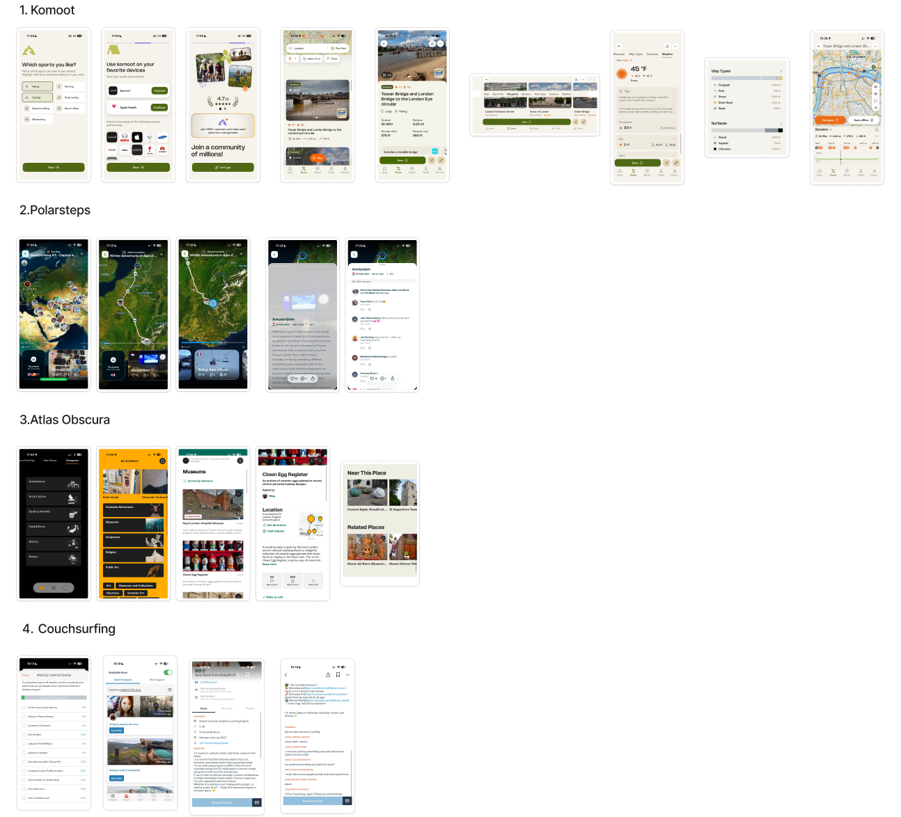
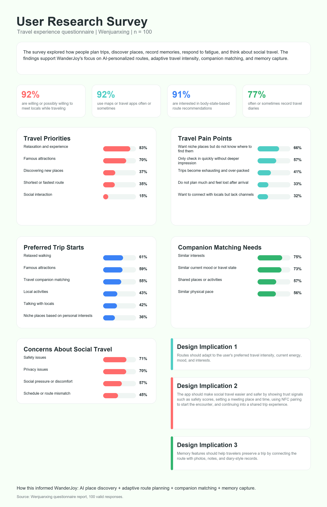
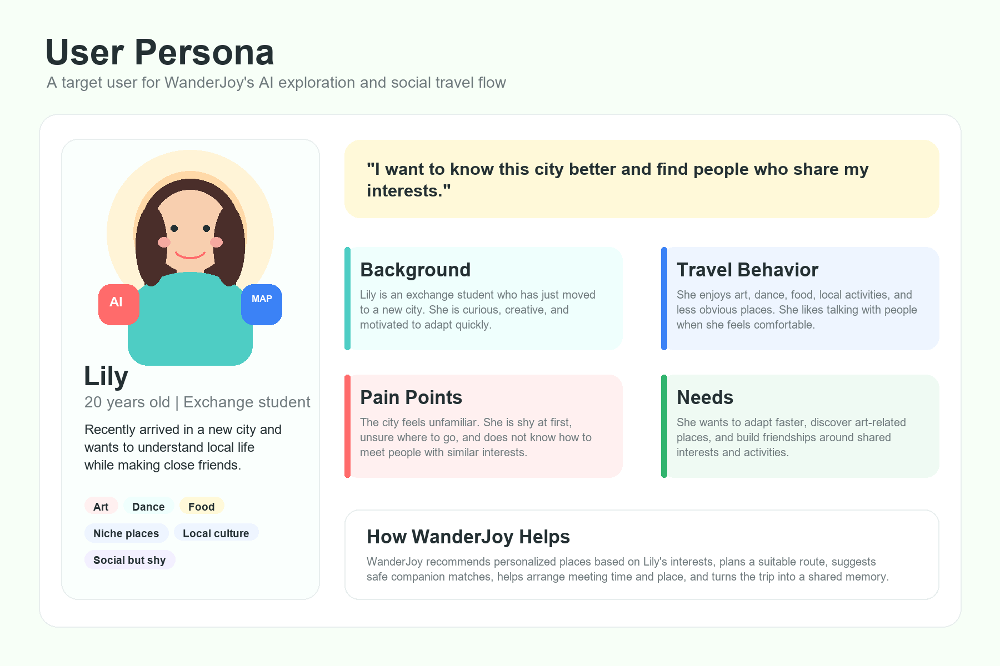
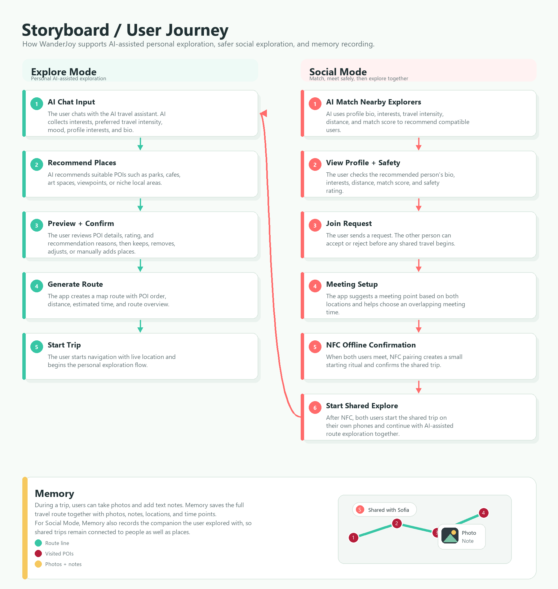

# WanderJoy Flutter

WanderJoy is a Flutter mobile app for playful, AI-assisted city exploration. It helps users describe what they want to do, discover real places, build a route, start navigation, meet compatible travel companions, and save route memories with photos.

## Background Research

Before building WanderJoy, I conducted desktop competitor research on four travel and exploration products: Komoot, Polarsteps, Atlas Obscura, and Couchsurfing. These references helped shape the app's direction around route planning, travel memory recording, unique place discovery, and social travel connection.

WanderJoy differs by combining AI-personalized place discovery, live route planning, social companion matching, and memory capture into one continuous travel flow instead of treating them as separate features.



## User Research

I also conducted a Wenjuanxing questionnaire survey with 100 valid responses to understand users' travel planning habits, pain points, social travel needs, and interest in adaptive route recommendations. The results showed strong demand for personalized place discovery, route planning based on physical state, travel memory recording, and safer companion matching.



## User Personas

Based on the survey insights, I created Lily as a target persona to represent new arrivals who want to understand a city, discover interest-based places, and build meaningful social connections through travel.



## Design Process

The design process started with competitor research and user survey insights, then translated these findings into a target persona, design implications, and key user flows. WanderJoy was shaped around two main scenarios: AI-assisted personal exploration and safer social exploration. The prototype turns these needs into practical screens for profile setup, AI chat, place recommendation, route confirmation, companion matching, NFC meeting confirmation, shared exploration, and memory saving.

## Storyboard / User Journey

The user journey shows WanderJoy's three main flows: Explore Mode for personal AI-assisted exploration, Social Mode for safely meeting a compatible companion, and Memory for saving the route, photos, notes, locations, time points, and social companion context after a trip.



## Core Features

- Google sign-in with Firebase Authentication
- AI-assisted Explore Mode with text and voice input
- OpenAI-powered voice transcription
- Real-place recommendations using OpenAI Responses API with Google Maps MCP
- Manual Google Maps place search and place detail loading
- Route planning with Google Directions API, OpenAI route planning fallback, and local estimated routing
- Live location updates, distance estimates, navigation cues, and Google Maps launch links
- Social Mode with local travel-companion matching
- Shared Explore flow that reuses the Explore route planner for two users
- Profile editing with Firestore persistence
- Route memory capture with photos, notes, map snapshots, and companion context

## Project Structure

```text
wanderjoy_flutter/
|-- lib/                         # Main Flutter application source code.
|   |-- main.dart                # App entry point; initializes Firebase and starts WanderJoyApp.
|   |-- app/                     # Root app setup, shell navigation, and authentication flow.
|   |   |-- wanderjoy_app.dart   # Creates MaterialApp, applies theme, and loads AuthGate.
|   |   |-- app_shell.dart       # Main signed-in shell with Explore, Social, Memory, and Me tabs.
|   |   `-- auth/                # Google/Firebase sign-in and preview-mode screens.
|   |       |-- auth_gate.dart   # Routes users to LoginScreen or AppShell based on auth state.
|   |       |-- auth_service.dart # Handles Google sign-in, Firebase auth, sign-out, and preview mode.
|   |       `-- login_screen.dart # Login UI with Google sign-in and preview access.
|   |-- core/                    # Shared app foundation code.
|   |   `-- theme/               # Global visual design tokens and Material theme.
|   |       |-- app_colors.dart   # Central color palette.
|   |       |-- app_spacing.dart  # Shared spacing constants.
|   |       `-- app_theme.dart    # Material 3 theme and text styles.
|   |-- features/                # Main product features.
|   |   |-- explore/             # AI place recommendation, route planning, maps, voice, and memories.
|   |   |-- social/              # Local companion matching, request flow, NFC-style launch, shared Explore.
|   |   |-- memory/              # Saved trip memories, route snapshots, companion history, photo views.
|   |   `-- me/                  # Profile editing, Firestore profile storage, avatar selection, sign-out.
|   `-- shared/                  # Reusable app-wide data, models, and UI widgets.
|       |-- data/                # Mock users, places, and sample memories for the prototype.
|       |-- models/              # Core data models such as Poi, UserProfile, and MemoryEntry.
|       `-- widgets/             # Shared UI components like cards, buttons, header, and bottom nav.
|-- test/                        # Flutter tests.
|-- android/                     # Android platform project.
|-- ios/                         # iOS platform project.
|-- web/                         # Web platform project.
|-- linux/                       # Linux desktop platform project.
|-- macos/                       # macOS desktop platform project.
|-- windows/                     # Windows desktop platform project.
|-- pubspec.yaml                 # Flutter package metadata, dependencies, and asset configuration.
`-- README.md                    # Project documentation.
```

## Application Flow

`main.dart` initializes Flutter bindings and Firebase, then starts `WanderJoyApp`.

`WanderJoyApp` creates the root `MaterialApp`, applies the custom app theme, and uses `AuthGate` as the home screen.

`AuthGate` listens to Firebase auth state and the app's preview-mode notifier:

- Signed in users enter `AppShell`
- Preview mode users enter `AppShell`
- Signed out users see `LoginScreen`
- Loading auth state shows a loading screen

`AppShell` provides the main four-tab experience:

- Explore
- Social
- Memory
- Me

Tab changes are handled locally with `AnimatedSwitcher`, so each feature screen can keep its own controller and state.

## Authentication

Authentication lives in `lib/app/auth/`.

`AuthService` handles Google sign-in and Firebase sign-in:

1. Start the Google account picker
2. Read the Google ID token and access token
3. Create a Firebase `GoogleAuthProvider` credential
4. Sign in with `FirebaseAuth.signInWithCredential`
5. Let `AuthGate` react to the new auth state

The service also includes detailed error messages for common Google and Firebase setup issues, such as missing credentials, network errors, invalid credentials, or Android Firebase configuration problems.

Preview mode is implemented with a `ValueNotifier<bool>`. It allows the UI to be demonstrated without removing or bypassing the real authentication system.

## Explore Mode

Explore Mode is the main AI travel-planning feature.

Main files:

```text
lib/features/explore/explore_screen.dart
lib/features/explore/explore_controller.dart
lib/features/explore/explore_agent_service.dart
lib/features/explore/voice_transcription_service.dart
```

Explore uses a state machine:

```text
home -> input -> customize -> route -> trip -> summary
```

### Input

Users can type a travel request or record voice input.

Voice input flow:

1. `record` captures audio as an `.m4a` file
2. The temporary audio file is sent to OpenAI's audio transcription endpoint
3. The returned transcript is placed into the text input
4. The transcript becomes the user's AI planning request

### AI Place Recommendation

When the user asks for recommendations, `ExploreController.generateInitialRoute()` gathers:

- Latest user input
- Saved profile interests
- Saved profile bio
- Preferred travel intensity
- Current location
- Conversation language
- Social trip context, if the flow came from Social Mode

`ExploreAgentService.recommend()` sends this context to the OpenAI Responses API. The prompt requires the model to use Google Maps MCP tools before recommending any real-world place. The app expects a strict JSON response containing recommended places, completion state, and a message.

If the AI needs more information, it returns a short follow-up question. If the request is complete, it returns real Google Maps places, which are converted into `Poi` models.

### Place Customization

After recommendations are returned, users can:

- Review suggested places
- Remove places
- Search for extra places
- Add manual Google Maps results
- Open place details

Detailed place data can be fetched from Google Places Details API, including:

- Google rating
- User rating count
- Opening hours
- Open-now status
- Photos
- Review summaries
- Google Maps URL

### Route Planning

When the user confirms the selected places, the controller attempts route planning in this order:

1. Google Directions API
2. OpenAI route planner with Google Maps MCP
3. Local estimated route ordering

The local fallback uses a nearest-stop ordering strategy and rough distance estimation, so the app can still display a route even when external route optimization is unavailable.

### Maps and Navigation

Route display supports two map modes:

- Embedded Google Maps in a WebView when `GOOGLE_MAPS_API_KEY` is available
- A custom painted estimated map when Google Maps embedding is unavailable

Navigation uses `geolocator` to get current location and stream location updates. The controller calculates:

- Distance from current location to each place
- Estimated travel minutes
- Next stop
- Route bearing
- Basic navigation cues such as continue straight, turn left, or turn right

Users can also open the route or a single place in Google Maps with `url_launcher`.

### Route Memories

During a route, users can capture a memory:

1. Pick or capture a photo with `image_picker`
2. Copy the image into the app documents directory
3. Add an optional note
4. Save a `MemoryEntry` into `MemoryRepository`
5. Build a `MemoryRouteSnapshot` containing route points, stops, photos, and companion data

These memories are shown later in Memory Mode.

## Social Mode

Social Mode is implemented in the Flutter frontend.

Main files:

```text
lib/features/social/social_screen.dart
lib/features/social/social_controller.dart
```

Social Mode uses this state machine:

```text
nearby -> profile -> request -> setup -> nfc -> sharedExplore
```

The matching logic uses local `MockData.users`. `SocialController` ranks nearby users by:

- Same city or nearby city
- Shared interests
- Safety rating
- Preferred intensity compatibility
- Pace match
- Profile bio keyword overlap
- Distance

After selecting a companion, the user can send a join request. The prototype simulates acceptance with a timer, then lets the user choose a meeting time and confirm an offline meeting with an NFC-style animation.

The shared route flow reuses Explore Mode:

```dart
ExploreScreen(
  initialStep: ExploreStep.input,
  tripContext: controller.sharedExploreContext,
)
```

The `ExploreTripContext` includes the selected companion's name, avatar, bio, interests, preferred intensity, and shared route ID. Explore Mode then combines both users' preferences before generating recommendations.

## Memory Mode

Memory Mode displays saved trip memories.

Main files:

```text
lib/features/memory/memory_screen.dart
lib/features/memory/memory_repository.dart
```

`MemoryRepository` uses a `ValueNotifier<List<MemoryEntry>>` so new route memories appear immediately in the UI.

The screen supports:

- Total trip count
- Explore trip count
- Social trip count
- Explore/Social filtering
- Travel companion display for social memories
- Memory detail pages
- Route snapshot maps
- Photo rails and photo detail views

If a memory has a route snapshot, Memory Mode can rebuild a visual route from saved route points, stops, and photo locations.

## Me / Profile Mode

Profile editing lives in:

```text
lib/features/me/me_screen.dart
```

Signed-in users can edit:

- Avatar
- Display name
- Age
- Interests
- Preferred intensity
- Safety rating
- Bio

Profile data is stored in Firestore at:

```text
profiles/{uid}
```

The profile form uses `SetOptions(merge: true)`, so updates preserve existing Firestore fields unless they are explicitly replaced by the form.

Avatar images are currently stored as local file paths after being copied into the app documents directory. This is suitable for the current prototype, but a production version would usually upload avatars to remote storage.

## Shared Models

Core app models are defined in:

```text
lib/shared/models/app_models.dart
```

Important models include:

- `UserProfile`
- `ExploreTripContext`
- `Poi`
- `MemoryEntry`
- `MemoryRouteSnapshot`
- `MemoryRoutePoint`
- `MemoryRouteStop`
- `MemoryRoutePhoto`

These models connect the four main features: Explore creates routes, Social passes companion context into Explore, Explore saves memories, and Memory displays route snapshots.

## Configuration

The app can run in preview mode without most external services, but full functionality uses these configuration values:

```text
OPENAI_API_KEY
OPENAI_MODEL
OPENAI_TRANSCRIBE_MODEL
GOOGLE_MAPS_API_KEY
```

Defaults:

```text
OPENAI_MODEL=gpt-5.2
OPENAI_TRANSCRIBE_MODEL=gpt-4o-mini-transcribe
```

Example Flutter run command:

```bash
flutter run \
  --dart-define=OPENAI_API_KEY=your_openai_key \
  --dart-define=GOOGLE_MAPS_API_KEY=your_google_maps_key
```

Firebase must also be configured for the target platform before Google sign-in and Firestore profile storage will work.

## Main Dependencies

- `firebase_core`, `firebase_auth`, `cloud_firestore`
- `google_sign_in`
- `record`
- `http`
- `path_provider`
- `image_picker`
- `geolocator`
- `url_launcher`
- `webview_flutter`
- `google_maps_flutter`

## Current Notes

- Social Mode does not require a backend in the current implementation.
- The app includes mock data for prototype users, places, and sample memories.
- Route and map features work best when both OpenAI and Google Maps keys are provided.
- Preview mode is available for UI testing without signing in.
